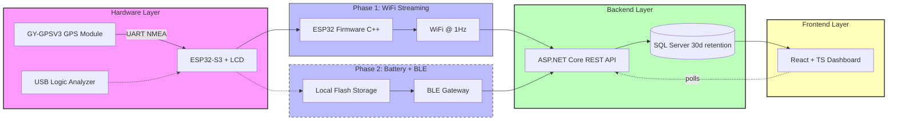
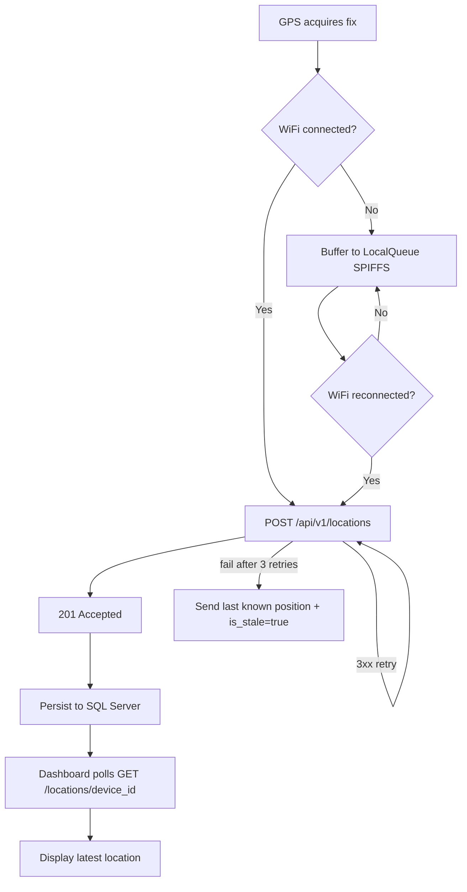
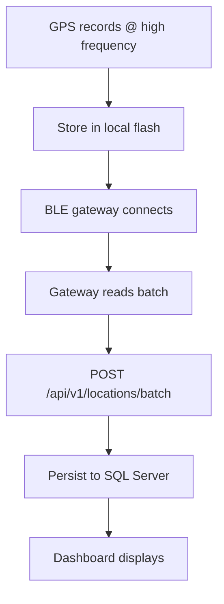
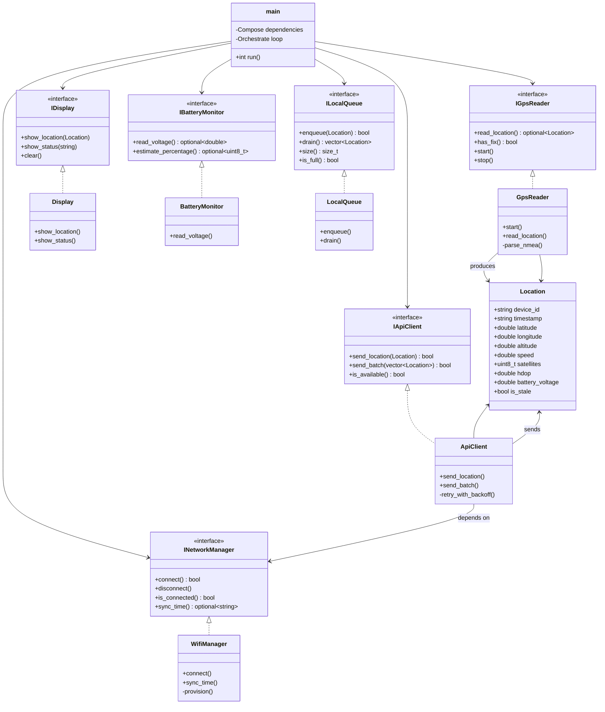
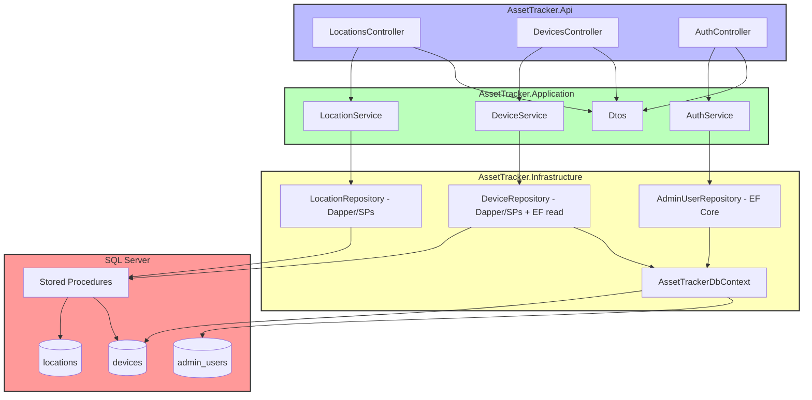
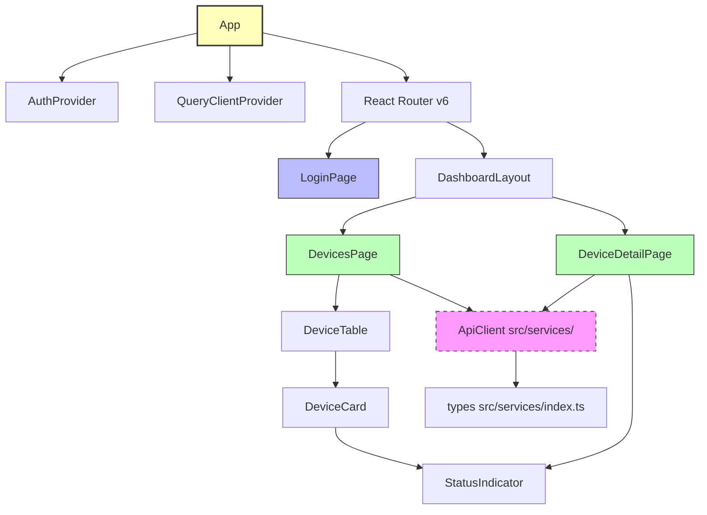

# System Diagrams

> Rendered on GitHub/GitLab via Mermaid. If you don't see diagrams, view in a Mermaid-compatible markdown viewer.

---

## 1. System Architecture

---

## 2. Data Flow — Phase 1 vs Phase 2

### Phase 1: WiFi Streaming (Active Development)

### Phase 2: BLE Gateway (Future)

---

## 3. Firmware Component Diagram

---

## 4. Backend Layer Architecture

---

## 5. Frontend Component Tree

